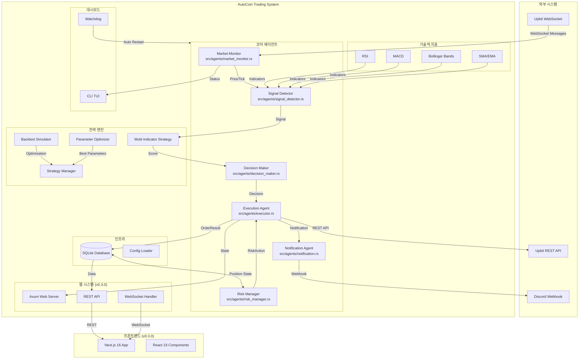
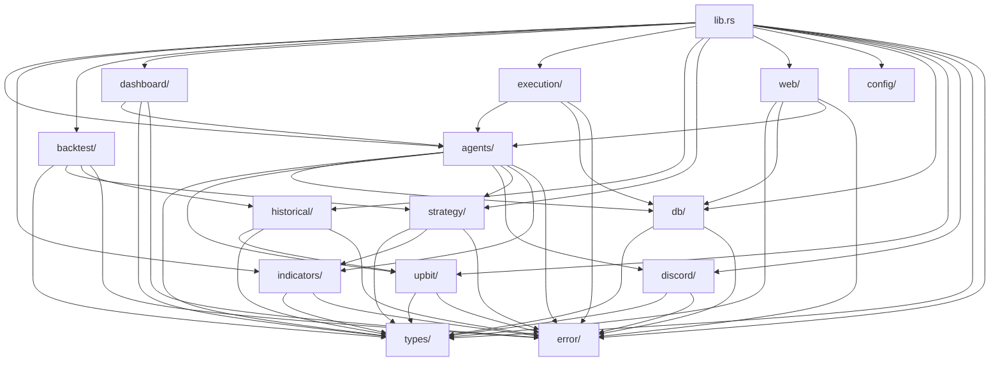
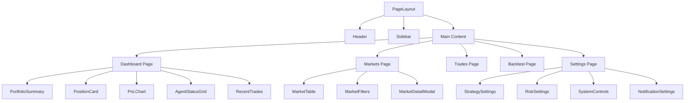

# Structure Document

## Overall Architecture Overview

AutoCoin은 **멀티 에이전트 아키텍처(Multi-Agent Architecture)**를 기반으로 하는 자동 트레이딩 시스템입니다. 각 에이전트는 독립적으로 동작하며 메시지 채널을 통해 통신합니다.

### Architecture Diagram



---

## Directory Structure

```
autocoin/
├── src/                          # Rust 백엔드 소스
│   ├── agents/                   # 멀티 에이전트 구현
│   │   ├── mod.rs                # 에이전트 모듈 정의
│   │   ├── market_monitor.rs     # 시장 모니터링 에이전트
│   │   ├── signal_detector.rs    # 신호 감지 에이전트
│   │   ├── decision_maker.rs     # 의사결정 에이전트
│   │   ├── executor.rs           # 주문 실행 에이전트
│   │   ├── risk_manager.rs       # 리스크 관리 에이전트
│   │   └── notification.rs       # 알림 에이전트
│   │
│   ├── indicators/               # 기술적 지표 (v0.2.0+)
│   │   ├── mod.rs                # 지표 모듈 정의
│   │   ├── rsi.rs                # RSI (Relative Strength Index)
│   │   ├── macd.rs               # MACD (Moving Average Convergence Divergence)
│   │   ├── bollinger.rs          # Bollinger Bands
│   │   └── moving_average.rs     # SMA/EMA (Simple/Exponential Moving Average)
│   │
│   ├── backtest/                 # 백테스팅 엔진 (v0.2.0+)
│   │   ├── mod.rs                # 백테스트 모듈 정의
│   │   ├── simulator.rs          # 거래 시뮬레이터
│   │   ├── metrics.rs            # 성과 메트릭 계산
│   │   └── optimizer.rs          # 파라미터 최적화
│   │
│   ├── dashboard/                # CLI 대시보드 (v0.2.0+)
│   │   ├── mod.rs                # 대시보드 모듈 정의
│   │   ├── ui.rs                 # TUI UI 구현
│   │   ├── renderer.rs           # 화면 렌더링
│   │   ├── layout.rs             # 레이아웃 관리
│   │   ├── widgets.rs            # 위젯 컴포넌트
│   │   ├── colors.rs             # 색상 테마
│   │   └── event_handler.rs      # 이벤트 핸들링
│   │
│   ├── execution/                # 실행 관리 (v0.2.0+)
│   │   ├── mod.rs                # 실행 모듈 정의
│   │   ├── service.rs            # 실행 서비스
│   │   └── watchdog.rs           # 워치독 프로세스
│   │
│   ├── historical/               # 과거 데이터 (v0.2.0+)
│   │   ├── mod.rs                # 과거 데이터 모듈
│   │   ├── fetcher.rs            # 데이터 수집기
│   │   └── cache.rs              # 데이터 캐시
│   │
│   ├── strategy/                 # 트레이딩 전략
│   │   ├── mod.rs                # 전략 모듈 정의
│   │   ├── momentum.rs           # 모멘텀 전략
│   │   ├── multi_indicator.rs    # 다중 지표 전략 (v0.2.0+)
│   │   └── strategy_manager.rs   # 전략 관리자 (v0.2.0+)
│   │
│   ├── web/                      # 웹 서버 (v0.3.0+)
│   │   ├── mod.rs                # 웹 모듈 정의
│   │   ├── server.rs             # Axum 서버 구현
│   │   ├── handlers.rs           # REST API 핸들러
│   │   ├── routes.rs             # 라우트 정의
│   │   ├── websocket.rs          # WebSocket 핸들러
│   │   └── state.rs              # 공유 상태 관리
│   │
│   ├── config/                   # 설정 관리
│   │   └── mod.rs                # 설정 로더
│   │
│   ├── db/                       # 데이터베이스
│   │   ├── mod.rs                # 데이터베이스 모듈
│   │   ├── models.rs             # 데이터 모델
│   │   └── schema.rs             # 스키마 정의
│   │
│   ├── discord/                  # Discord 통합
│   │   ├── mod.rs                # Discord 모듈
│   │   └── webhook.rs            # Webhook 클라이언트
│   │
│   ├── upbit/                    # Upbit API 클라이언트
│   │   ├── mod.rs                # Upbit 모듈
│   │   ├── client.rs             # REST API 클라이언트
│   │   ├── websocket.rs          # WebSocket 클라이언트
│   │   └── models.rs             # API 모델
│   │
│   ├── types/                    # 핵심 데이터 타입
│   │   ├── mod.rs                # 타입 모듈
│   │   └── trading.rs            # 트레이딩 타입 정의
│   │
│   ├── error.rs                  # 에러 처리
│   ├── lib.rs                    # 라이브러리 엔트리
│   └── main.rs                   # 실행 파일 엔트리
│
├── web/                          # Next.js 프론트엔드 (v0.3.0+)
│   ├── app/                      # App Router
│   │   ├── page.tsx              # 메인 페이지
│   │   ├── layout.tsx            # 루트 레이아웃
│   │   ├── globals.css           # 전역 스타일
│   │   ├── dashboard/            # 대시보드 페이지
│   │   │   └── page.tsx
│   │   ├── markets/              # 시장 페이지
│   │   │   └── page.tsx
│   │   ├── trades/               # 거래 내역 페이지
│   │   │   └── page.tsx
│   │   ├── backtest/             # 백테스팅 페이지
│   │   │   └── page.tsx
│   │   ├── settings/             # 설정 페이지
│   │   │   └── page.tsx
│   │   └── providers/            # React Context Provider
│   │       ├── theme-provider.tsx
│   │       └── websocket-provider.tsx
│   │
│   ├── components/               # React 컴포넌트
│   │   ├── dashboard/            # 대시보드 컴포넌트
│   │   │   ├── PortfolioSummary.tsx
│   │   │   ├── PositionCard.tsx
│   │   │   ├── PnLChart.tsx
│   │   │   ├── AgentStatusGrid.tsx
│   │   │   └── RecentTrades.tsx
│   │   ├── markets/              # 시장 컴포넌트
│   │   │   ├── MarketTable.tsx
│   │   │   ├── MarketFilters.tsx
│   │   │   └── MarketDetailModal.tsx
│   │   ├── settings/             # 설정 컴포넌트
│   │   │   ├── StrategySettings.tsx
│   │   │   ├── RiskSettings.tsx
│   │   │   ├── SystemControls.tsx
│   │   │   └── NotificationSettings.tsx
│   │   ├── layout/               # 레이아웃 컴포넌트
│   │   │   ├── header.tsx
│   │   │   ├── sidebar.tsx
│   │   │   ├── navigation.tsx
│   │   │   └── theme-toggle.tsx
│   │   └── ui/                   # shadcn/ui 기본 컴포넌트
│   │       ├── button.tsx
│   │       ├── card.tsx
│   │       ├── badge.tsx
│   │       ├── table.tsx
│   │       ├── input.tsx
│   │       ├── select.tsx
│   │       ├── switch.tsx
│   │       ├── tabs.tsx
│   │       └── dialog.tsx
│   │
│   ├── lib/                      # 유틸리티
│   │   ├── api-client.ts         # API 클라이언트
│   │   ├── formatters.ts         # 한국어 포맷터
│   │   └── utils.ts              # 유틸리티 함수
│   │
│   ├── package.json              # Node.js 의존성
│   ├── tsconfig.json             # TypeScript 설정
│   ├── tailwind.config.ts        # Tailwind 설정
│   └── next.config.js            # Next.js 설정
│
├── config/                       # 설정 파일
│   └── strategy.toml             # 전략 설정
│
├── systemd/                      # systemd 서비스 파일 (v0.2.0+)
├── taskscheduler/                # Windows Task Scheduler (v0.2.0+)
├── data/                         # 데이터 디렉토리 (Git 제외)
│   └── trading.db                # SQLite 데이터베이스
│
├── .moai/                        # MoAI-ADK 설정
│   ├── config/                   # MoAI 설정
│   ├── specs/                    # SPEC 문서
│   └── project/                  # 프로젝트 문서
│
├── .env.example                  # 환경 변수 예시
├── .gitignore                    # Git 제외 파일
├── Cargo.toml                    # Rust 의존성
├── README.md                     # 프로젝트 설명
├── ARCHITECTURE.md               # 아키텍처 상세
└── API.md                        # API 통합 문서
```

---

## Module Relationships

### Dependency Graph



---

## Core Modules

### 1. Agents Module (src/agents/)

**책임**: 트레이딩 로직의 핵심 에이전트 구현

| 파일 | 에이전트 | 주요 책임 |
|------|---------|-----------|
| `market_monitor.rs` | Market Monitor | Upbit WebSocket 연결, 실시간 시세 수집 |
| `signal_detector.rs` | Signal Detector | 모멘텀 감지, 매수/매도 신호 생성 |
| `decision_maker.rs` | Decision Maker | 포지션 상태 확인, 최종 거래 결정 |
| `executor.rs` | Execution Agent | 주문 실행, 체결 확인, DB 저장 |
| `risk_manager.rs` | Risk Manager | 손절/익절 모니터링, PnL 계산 |
| `notification.rs` | Notification Agent | Discord 알림 전송 |

**통신 채널**:
- `price_tx`: Market Monitor → Signal Detector
- `signal_tx`: Signal Detector → Decision Maker
- `decision_tx`: Decision Maker → Execution Agent
- `order_tx`: Execution Agent → Notification Agent
- `risk_decision_tx`: Risk Manager → Execution Agent

### 2. Indicators Module (src/indicators/)

**책임**: 기술적 지표 계산

| 지표 | 설명 | 사용 전략 |
|------|------|-----------|
| RSI | 상대 강도 지표 (0-100) | 과매수/과매도 판단 |
| MACD | 이동평균 수렴 발산 | 추세 반전 신호 |
| Bollinger Bands | 변동성 밴드 | 가격 범위 분석 |
| SMA/EMA | 단순/지수 이동평균 | 추세 방향 확인 |

### 3. Backtest Module (src/backtest/)

**책임**: 과거 데이터 기반 전략 검증

| 컴포넌트 | 설명 |
|---------|------|
| `simulator.rs` | 거래 시뮬레이션 엔진 |
| `metrics.rs` | 수익률, 승률, Sharpe Ratio 계산 |
| `optimizer.rs` | 그리드 서치 기반 파라미터 최적화 |

### 4. Dashboard Module (src/dashboard/)

**책임**: CLI TUI 대시보드

| 컴포넌트 | 설명 |
|---------|------|
| `ui.rs` | ratatui 기반 UI 구현 |
| `renderer.rs` | 화면 렌더링 로직 |
| `layout.rs` | 4패널 레이아웃 관리 |
| `widgets.rs` | 개별 위젯 컴포넌트 |
| `colors.rs` | 색상 테마 정의 |

### 5. Web Module (src/web/)

**책임**: 웹 서버 및 API (v0.3.0+)

| 컴포넌트 | 설명 |
|---------|------|
| `server.rs` | Axum 서버 구현 |
| `handlers.rs` | REST API 핸들러 |
| `routes.rs` | 라우트 정의 |
| `websocket.rs` | WebSocket 핸들러 |
| `state.rs` | 공유 상태 관리 |

**REST API 엔드포인트**:
| 메서드 | 경로 | 설명 |
|--------|------|------|
| GET | `/api/health` | 헬스 체크 |
| GET | `/api/status` | 시스템 상태 |
| GET | `/api/balance` | 잔고 조회 |
| GET | `/api/position` | 현재 포지션 |
| GET | `/api/trades` | 거래 내역 |
| GET | `/api/markets` | 시장 데이터 |
| POST | `/api/orders` | 수동 주문 |
| DELETE | `/api/position` | 포지션 청산 |
| PUT | `/api/settings` | 설정 업데이트 |
| POST | `/api/trading/pause` | 트레이딩 일시정지 |
| POST | `/api/trading/resume` | 트레이딩 재개 |

### 6. Strategy Module (src/strategy/)

**책임**: 트레이딩 전략 구현

| 전략 | 설명 | 신호 조건 |
|------|------|-----------|
| Momentum | 모멘텀 추종 | 가격 급등 + 거래량 급증 |
| Multi-Indicator | 다중 지표 결합 | RSI + MACD + 볼린저 밴드 종합 |

### 7. Database Module (src/db/)

**책임**: SQLite 데이터베이스 관리

| 테이블 | 설명 |
|--------|------|
| `positions` | 포지션 정보 |
| `orders` | 주문 내역 |
| `price_ticks` | 가격 틱 데이터 |
| `signals` | 신호 내역 |

### 8. Upbit Module (src/upbit/)

**책임**: Upbit API 클라이언트

| 컴포넌트 | 설명 |
|---------|------|
| `client.rs` | REST API 클라이언트 |
| `websocket.rs` | WebSocket 클라이언트 |
| `models.rs` | API 데이터 모델 |

---

## Frontend Structure (web/)

### Page Routes

| 경로 | 페이지 | 설명 |
|------|--------|------|
| `/` | Dashboard | 메인 대시보드 |
| `/markets` | Markets | 시장 데이터 |
| `/trades` | Trades | 거래 내역 |
| `/backtest` | Backtest | 백테스팅 |
| `/settings` | Settings | 설정 관리 |

### Component Hierarchy



---

## Data Flow

### Trading Lifecycle

1. **Market Monitor** → WebSocket으로 가격 데이터 수신
2. **Signal Detector** → 가격 데이터 분석, 기술적 지표 계산
3. **Multi-Indicator Strategy** → 다중 지표 종합 신호 점수 계산
4. **Decision Maker** → 포지션 상태 확인 후 최종 결정
5. **Execution Agent** → Upbit API로 주문 실행
6. **Risk Manager** → 포지션 모니터링, 손절/익절 실행
7. **Notification Agent** → Discord로 알림 전송
8. **Database** → 모든 상태 저장

### Real-time Updates (v0.3.0+)

1. **Trading System** → 상태 변경 감지
2. **Axum WebSocket Handler** → 브로드캐스트
3. **Next.js WebSocket Client** → 수신
4. **React Components** → 상태 업데이트

---

## Integration Points

### External System Integration

| 시스템 | 프로토콜 | 용도 |
|--------|----------|------|
| Upbit API | HTTPS REST | 주문, 계정 정보 조회 |
| Upbit WebSocket | WSS | 실시간 시세 |
| Discord Webhook | HTTPS POST | 알림 전송 |

### Internal Module Integration

| 모듈 | 통신 방식 | 데이터 |
|------|-----------|--------|
| Agents ↔ Agents | mpsc::channel | 메시지 |
| Web ↔ Trading System | Axum State | 공유 상태 |
| Frontend ↔ Backend | WebSocket / REST | JSON |

---

## Deployment Architecture

```
┌─────────────────────────────────────────────────────────────┐
│                      Server / Local Machine                 │
├─────────────────────────────────────────────────────────────┤
│                                                              │
│  ┌────────────────────────────────────────────────────────┐  │
│  │           AutoCoin Trading Bot (Rust)                 │  │
│  │  ┌─────────┐  ┌─────────┐  ┌─────────┐  ┌─────────┐  │  │
│  │  │ Agents  │→ │Strategy │→ │Executor │→ │  Risk   │  │  │
│  │  └─────────┘  └─────────┘  └─────────┘  └─────────┘  │  │
│  │                                                       │  │
│  │  ┌─────────────────────────────────────────────────┐ │  │
│  │  │         Axum Web Server (Port 8080)             │ │  │
│  │  │  ┌──────────┐  ┌──────────┐  ┌──────────┐      │ │  │
│  │  │  │   REST   │  │WebSocket │  │  Static  │      │ │  │
│  │  │  │   API    │  │ Handler  │  │  Files   │      │ │  │
│  │  │  └──────────┘  └──────────┘  └──────────┘      │ │  │
│  │  └─────────────────────────────────────────────────┘ │  │
│  └────────────────────────────────────────────────────────┘  │
│                          │                                   │
│  ┌────────────────────────────────────────────────────────┐  │
│  │         Next.js Dev Server (Port 3000)                 │  │
│  │                   (개발 환경 전용)                      │  │
│  └────────────────────────────────────────────────────────┘  │
│                          │                                   │
└──────────────────────────┼───────────────────────────────────┘
                           │
                           │ HTTP/WS
                           ▼
                    ┌─────────────┐
                    │   Browser   │
                    │  (Client)   │
                    └─────────────┘
```

---

## HISTORY

| Version | Date | Changes |
|---------|------|---------|
| v1.0.0 | 2026-02-08 | 최초 작성 (SPEC-TRADING-001~004 통합) |
