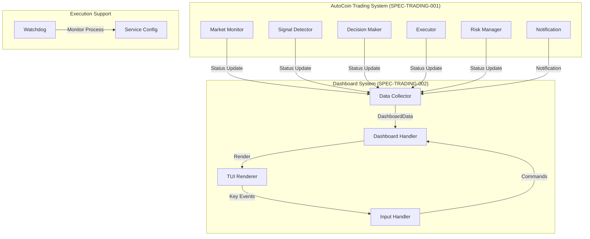

# SPEC-TRADING-002: Implementation Plan

## TAG BLOCK

```
SPEC-ID: SPEC-TRADING-002
Related: spec.md, acceptance.md
Last Updated: 2026-02-07
```

---

## 1. Implementation Strategy (구현 전략)

### 1.1 Architecture Overview



### 1.2 Module Structure

```
src/
├── dashboard/
│   ├── mod.rs              # Dashboard module entry
│   ├── renderer.rs         # TUI rendering logic
│   ├── layout.rs           # Panel layout management
│   ├── data_collector.rs   # Agent state collection
│   ├── input_handler.rs    # Keyboard input processing
│   ├── widgets.rs          # Custom ratatui widgets
│   └── colors.rs           # Color scheme definitions
├── cli/
│   ├── mod.rs              # CLI module entry
│   ├── args.rs             # CLI argument parsing
│   └── commands.rs         # Command handlers
├── execution/
│   ├── mod.rs              # Execution support module
│   ├── watchdog.rs         # Process monitoring
│   └── service.rs          # Systemd/Task Scheduler config
└── main.rs                 # Entry point with mode selection
```

---

## 2. Implementation Milestones

### Milestone 1: 기본 TUI 구조 (Priority: High)

**목표**: ratatui 기반 4패널 대시보드 기본 구조 구현

**작업 항목**:
1. `Cargo.toml`에 ratatui, crossterm 의존성 추가
2. `src/dashboard/` 모듈 생성
3. 기본 4패널 레이아웃 구현 (Status, Position, Balance, Market)
4. 더미 데이터로 UI 렌더링 테스트

**기술 세부사항**:
```rust
// src/dashboard/mod.rs
pub struct Dashboard {
    terminal: Terminal<CrosstermBackend<Stdout>>,
    data_rx: mpsc::Receiver<DashboardData>,
}

impl Dashboard {
    pub fn new() -> Result<Self>;
    pub fn run(&mut self) -> Result<()>;
    fn draw(&mut self) -> Result<()>;
}
```

**성공 기준**:
- 터미널에 4패널 레이아웃이 정상적으로 표시됨
- 더미 데이터가 각 패널에 렌더링됨
- 'q' 키로 정상 종료됨

### Milestone 2: 에이전트 연동 (Priority: High)

**목표**: 기존 에이전트 상태를 대시보드로 전송

**작업 항목**:
1. `DashboardData` 구조체 정의
2. 에이전트 모듈에 상태 전송 로직 추가
3. 비동기 채널 연결
4. 실시간 업데이트 구현

**기술 세부사항**:
```rust
// 공유 데이터 타입
#[derive(Clone, Debug)]
pub struct DashboardData {
    pub timestamp: DateTime<Utc>,
    pub agent_states: HashMap<String, AgentState>,
    pub position: Option<PositionData>,
    pub balance: BalanceData,
    pub market_prices: Vec<CoinPrice>,
    pub notifications: Vec<Notification>,
}

#[derive(Clone, Debug)]
pub enum AgentState {
    Running { last_update: DateTime<Utc> },
    Idle { since: DateTime<Utc> },
    Error { message: String },
}
```

**성공 기준**:
- 에이전트 상태 변경이 대시보드에 반영됨
- 포지션 정보가 실시간으로 업데이트됨
- UI 갱신이 트레이딩 루프를 차단하지 않음

### Milestone 3: 백그라운드 모드 (Priority: High)

**목표**: 데몬 모드로 백그라운드 실행 지원

**작업 항목**:
1. CLI 인자 파싱 구현 (`--dashboard`, `--daemon`)
2. 데몬 모드 실행 로직 구현
3. 로그 파일 출력 구현
4. TUI 비활성화 분기 처리

**기술 세부사항**:
```rust
// src/cli/args.rs
#[derive(Parser)]
#[command(name = "autocoin")]
#[command(about = "Upbit Automated Trading Agent System")]
pub struct Args {
    /// Run with TUI dashboard
    #[arg(long, default_value = "true")]
    pub dashboard: bool,

    /// Run as background daemon
    #[arg(long, default_value = "false")]
    pub daemon: bool,

    /// Log file path
    #[arg(long)]
    pub log_file: Option<PathBuf>,

    /// Log level
    #[arg(long, default_value = "info")]
    pub log_level: String,
}
```

**성공 기준**:
- `--daemon` 플래그로 백그라운드 실행됨
- TUI가 표시되지 않고 로그만 출력됨
- `--dashboard` 플래그로 TUI가 정상 표시됨

### Milestone 4: 운영 안정성 (Priority: Medium)

**목표**: 자동 재시작 및 서비스 등록 지원

**작업 항목**:
1. Linux systemd service 파일 생성
2. Windows Task Scheduler 스크립트 생성
3. 설치/등록 명령어 구현
4. 워치독 프로세스 모듈 구현

**기술 세부사항**:
```rust
// src/execution/watchdog.rs
pub struct Watchdog {
    child_process: Option<Child>,
    max_restarts: u32,
    restart_delay: Duration,
}

impl Watchdog {
    pub fn new() -> Self;
    pub fn monitor(&mut self) -> Result<()>;
    fn is_process_alive(&self) -> bool;
    fn restart_process(&mut self) -> Result<()>;
}
```

**파일 구조**:
```
deployment/
├── systemd/
│   └── autocoin.service
├── windows/
│   └── task-scheduler.xml
└── install.sh
```

**성공 기준**:
- 프로세스 크래시 시 자동 재시작됨
- PC 재부팅 후 자동으로 서비스 시작됨
- 최대 3회 재시도 후 중단 및 알림

### Milestone 5: 고급 기능 (Priority: Low)

**목표**: 사용성 향상을 위한 추가 기능

**작업 항목**:
1. 히스토리 PnL 그래프 (ASCII art)
2. 다크/라이트 모드 전환
3. 대화형 키 기능 확장 (일시정지/재개)
4. Compact 모드 개선

**성공 기준**:
- 선택적 기능으로 메인 기능에 영향 없음
- 터미널 크기에 따라 자동 적응

---

## 3. Technical Approach

### 3.1 Data Flow Architecture

**Non-blocking Design**:
1. 에이전트는 트레이딩 로직 수행
2. 상태 변경 시 `try_send()`로 비동기 전송
3. 대시보드는 별도 태스크로 실행
4. 채널 버퍼가 가득 차면 오래된 데이터 폐기

```rust
// 메인 함수 구조
#[tokio::main]
async fn main() -> Result<()> {
    let args = Args::parse();

    // 데이터 채널 생성 (bounded, non-blocking)
    let (data_tx, data_rx) = mpsc::channel::<DashboardData>(100);

    // 트레이딩 시스템 시작
    let trading_handle = spawn_trading_system(data_tx).await?;

    // 대시보드 또는 데몬 모드 시작
    if args.daemon {
        run_daemon_mode().await?;
    } else if args.dashboard {
        run_dashboard_mode(data_rx).await?;
    }

    Ok(())
}
```

### 3.2 UI Update Strategy

**Tick-based Rendering**:
- 1초 간격 tick으로 UI 갱신
- 데이터 변경 시에만 렌더링 (최적화)
- 레이아웃 캐시로 불필요한 계산 방지

```rust
// src/dashboard/renderer.rs
const UI_REFRESH_INTERVAL: Duration = Duration::from_secs(1);

pub async fn run_dashboard(mut rx: Receiver<DashboardData>) -> Result<()> {
    let mut interval = tokio::time::interval(UI_REFRESH_INTERVAL);
    let mut current_data = DashboardData::default();

    loop {
        tokio::select! {
            // 데이터 수신
            Some(data) = rx.recv() => {
                current_data = data;
            }
            // 주기적 렌더링
            _ = interval.tick() => {
                draw(&mut terminal, &current_data)?;
            }
            // 키 입력
            result = event::read() => {
                handle_input(result?)?;
            }
        }
    }
}
```

### 3.3 Cross-Platform Considerations

| 기능 | Linux | macOS | Windows |
|------|-------|-------|---------|
| TUI | ratatui/crossterm | ratatui/crossterm | ratatui/crossterm |
| Daemon | systemd | launchd | Task Scheduler |
| Watchdog | systemd Restart | launchd | Task Scheduler Retry |
| PID File | /var/run | /var/run | C:\autocoin |

---

## 4. Testing Strategy

### 4.1 Unit Tests

- `layout.rs`: 패널 크기 계산
- `data_collector.rs`: 상태 수집 로직
- `input_handler.rs`: 키 입력 처리
- `colors.rs`: 색상 테마

### 4.2 Integration Tests

- 에이전트 ↔ 대시보드 데이터 통신
- CLI 인자 파싱 및 모드 분기
- 터미널 크기 변경 처리

### 4.3 Manual Testing

- TUI 렌더링 (다양한 터미널)
- 백그라운드 모드 실행
- 크래시 복구 시나리오

---

## 5. Risk Management

### 5.1 Identified Risks

| 리스크 | 영향 | 완화 전략 |
|--------|------|----------|
| UI가 트레이딩 루프 차단 | 높음 | 비동기 채널, 별도 태스크 |
| 터미널 호환성 문제 | 중간 | Compact 모드, 폴백 |
| 메모리 누수 (UI 버퍼) | 중간 | 알림 버퍼 크기 제한 |
| 백그라운드 모드 디버깅 어려움 | 낮음 | 상세 로그 파일 |

### 5.2 Mitigation Implementation

```rust
// 비동기 전송 (블로킹 방지)
if let Err(_) = data_tx.try_send(data) {
    // 채널 가득참: 로그만 기록, 트레이딩 계속
    tracing::warn!("Dashboard channel full, dropping update");
}

// 알림 버퍼 크기 제한
const MAX_NOTIFICATIONS: usize = 50;
if notifications.len() > MAX_NOTIFICATIONS {
    notifications.remove(0);
}
```

---

## 6. Dependencies

### 6.1 New Crates

```toml
[dependencies]
# TUI
ratatui = { version = "0.28", features = ["all-widgets"] }
crossterm = "0.28"

# CLI
clap = { version = "4.5", features = ["derive"] }

# 기존 SPEC-TRADING-001 의존성 유지
```

### 6.2 Dependency Graph

```
ratatui
  └── crossterm (터미널 처리)

dashboard/mod.rs
  ├── renderer.rs (ratatui)
  ├── layout.rs
  ├── data_collector.rs (mpsc)
  └── input_handler.rs (crossterm)

cli/mod.rs
  ├── args.rs (clap)
  └── commands.rs
```

---

## 7. Definition of Done

각 마일스톤이 완료되었음을 확인하기 위해:

- [ ] 모든 요구사항 (REQ-101 ~ REQ-123)이 구현됨
- [ ] 단위 테스트 통과 (>80% 커버리지)
- [ ] 통합 테스트 통과
- [ ] 수동 테스트 완료 (TUI, Daemon)
- [ ] README.md 업데이트 (새로운 실행 옵션)
- [ ] 코드 리뷰 완료
- [ ] Lint 통과 (clippy)

---

## 8. Next Steps

구현 완료 후:

1. `/moai:2-run SPEC-TRADING-002` - DDD 구현 단계
2. 사용자 매뉴얼 업데이트
3. 배포 패키지 생성 (systemd service 포함)
4. 사용자 피드백 수집
