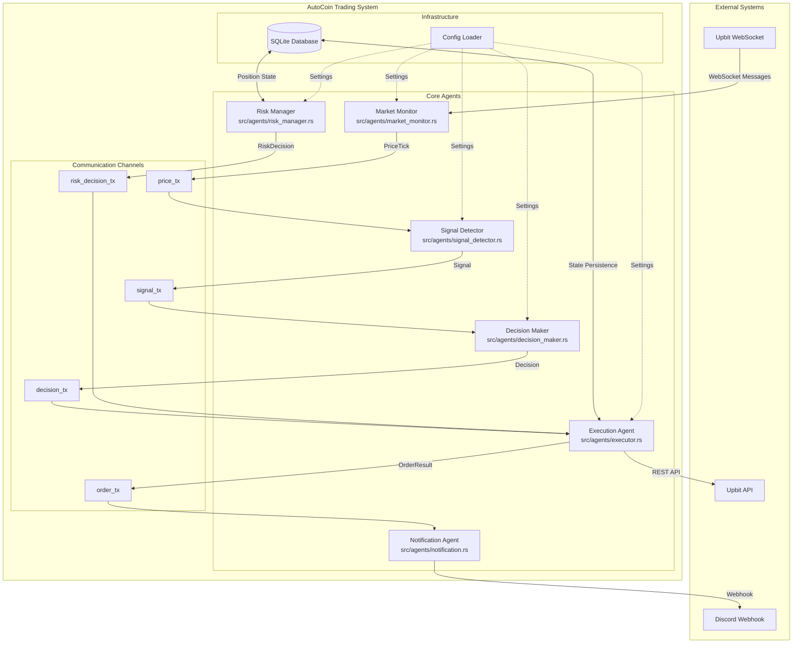
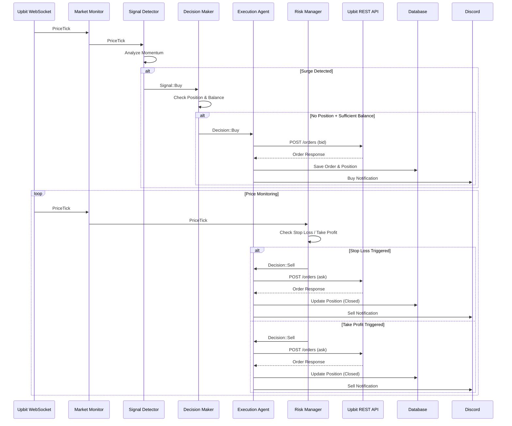
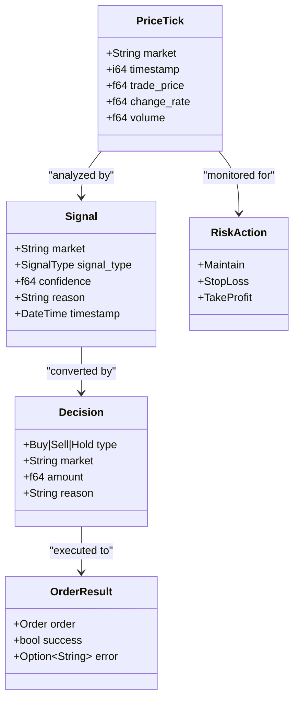
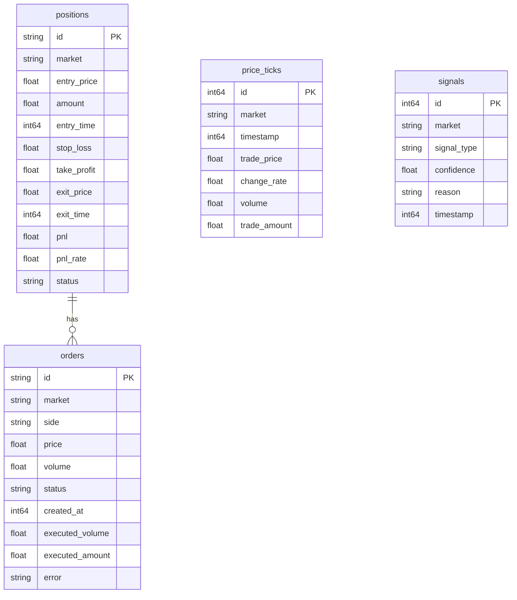
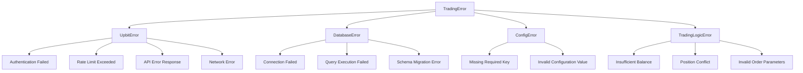
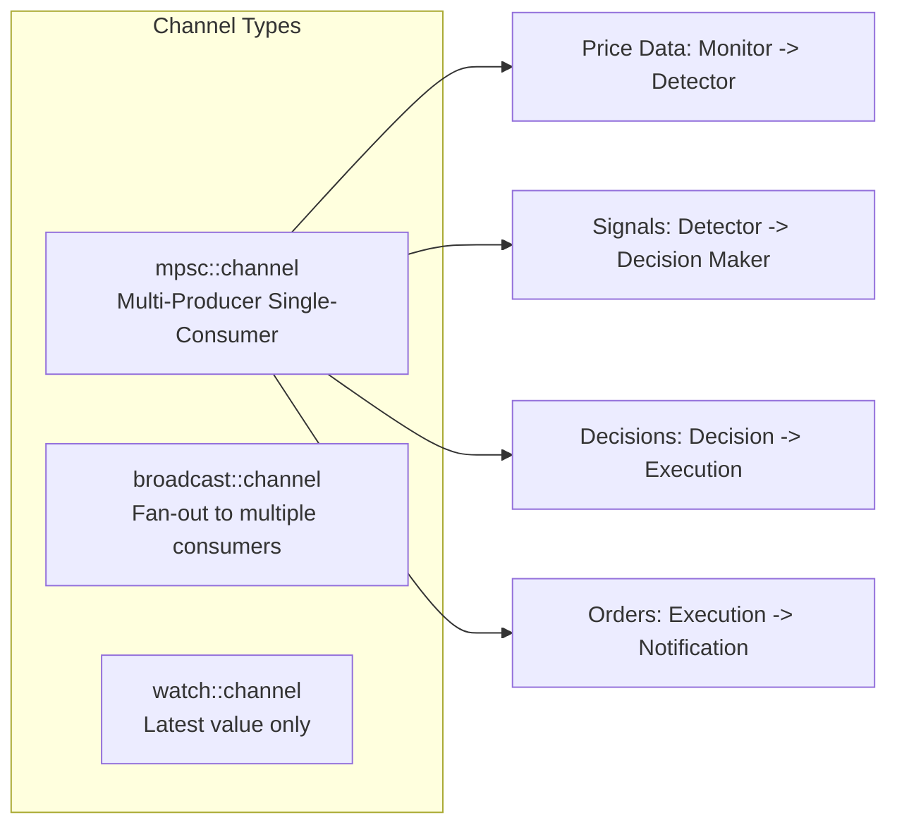
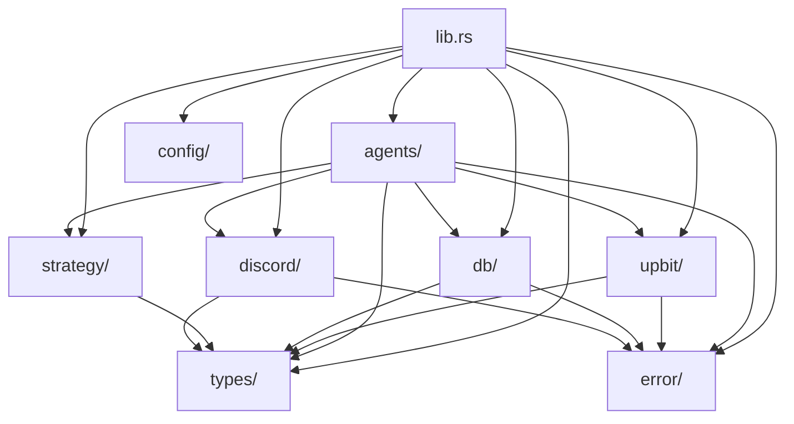

# Architecture Document

AutoCoin Upbit Automated Trading Agent System Architecture

## Table of Contents

- [Overview](#overview)
- [Multi-Agent Architecture](#multi-agent-architecture)
- [Data Flow](#data-flow)
- [Component Details](#component-details)
- [Database Schema](#database-schema)
- [Error Handling](#error-handling)
- [Concurrency Model](#concurrency-model)

---

## Overview

AutoCoin은 **멀티 에이전트 아키텍처(Multi-Agent Architecture)**를 기반으로 하는 자동 트레이딩 시스템입니다. 각 에이전트는 독립적으로 동작하며 메시지 채널을 통해 서로 통신합니다.

### Design Principles

- **Separation of Concerns**: 각 에이전트는 단일 책임을 가집니다
- **Loose Coupling**: 에이전트 간 통신은 메시지 채널로 이루어집니다
- **Fault Isolation**: 한 에이전트의 실패가 다른 에이전트에 영향을 주지 않습니다
- **Horizontal Scalability**: 필요시 에이전트를 독립적으로 확장할 수 있습니다

---

## Multi-Agent Architecture

### System Architecture Diagram



### Agent Responsibilities

| Agent | File | Responsibilities |
|-------|------|------------------|
| **Market Monitor** | `market_monitor.rs` | - Upbit WebSocket 연결 관리<br/>- 실시간 가격 데이터 수집<br/>- 연결 끊김 시 재연결 |
| **Signal Detector** | `signal_detector.rs` | - 가격 히스토리 관리<br/>- 모멘텀/서징 감지<br/>- 매수/매도 신호 생성 |
| **Decision Maker** | `decision_maker.rs` | - 포지션 상태 추적<br/>- 잔고 확인<br/>- 최종 거래 결정 |
| **Execution Agent** | `executor.rs` | - 주문 제출<br/>- 체결 확인<br/>- DB 상태 저장 |
| **Risk Manager** | `risk_manager.rs` | - 손절/익절 모니터링<br/>- 리스크 평가 |
| **Notification Agent** | `notification.rs` | - Discord 알림 전송<br/>- 알림 포맷팅 |

---

## Data Flow

### Trading Lifecycle



### Message Types



---

## Component Details

### 1. Market Monitor Agent

**Purpose**: Upbit WebSocket을 통해 실시간 가격 데이터를 수집합니다.

**Key Features**:
- 자동 재연결 메커니즘
- 데이터 검증 및 필터링
- 멀티 마켓 구독 (최대 20개)

**Implementation**:
```rust
pub struct MarketMonitor {
    ws_client: WebSocketClient,
    markets: Vec<String>,
}

impl MarketMonitor {
    pub async fn monitor(&self, tx: mpsc::Sender<PriceTick>) -> Result<()>;
}
```

### 2. Signal Detector Agent

**Purpose**: 모멘텀 전략을 기반으로 매수/매도 신호를 생성합니다.

**Detection Logic**:
- 가격이 N% 이상 상승 (기본 5%)
- 거래량이 평균의 M배 이상 (기본 2배)
- 지정된 시간 프레임 내 발생 (기본 60분)

**Implementation**:
```rust
pub struct SignalDetector {
    strategy: MomentumStrategy,
    price_rx: mpsc::Receiver<PriceTick>,
}

impl SignalDetector {
    pub async fn run(mut self) -> Result<()>;
}
```

### 3. Decision Maker Agent

**Purpose**: 포지션 상태와 잔고를 고려하여 최종 거래 결정을 내립니다.

**Decision Rules**:
- 기존 포지션이 있으면 새 매수 금지
- 잔고가 최소 주문 금액 미만이면 매수 건너뜀
- 단일 포지션 전략 강제

### 4. Execution Agent

**Purpose**: Upbit API를 통해 주문을 실행하고 결과를 저장합니다.

**Rate Limiting**:
- 초당 10회 제한 준수
- Exponential Backoff로 재시도

### 5. Risk Manager Agent

**Purpose**: 포지션을 모니터링하고 손절/익절을 실행합니다.

**Risk Parameters**:
- 손절가: 진입가 * (1 - 손절률)
- 익절가: 진입가 * (1 + 수익률)

### 6. Notification Agent

**Purpose**: Discord로 거래 결과를 알립니다.

**Notification Types**:
| Type | Color | Condition |
|------|-------|-----------|
| BUY | Green | 매수 체결 |
| SELL | Red | 매도 체결 |
| SIGNAL | Yellow | 매수 신호 감지 |
| ERROR | Orange | 에러 발생 |

---

## Database Schema

### Tables



### Schema Initialization

```sql
-- Positions Table
CREATE TABLE IF NOT EXISTS positions (
    id TEXT PRIMARY KEY,
    market TEXT NOT NULL,
    entry_price REAL NOT NULL,
    amount REAL NOT NULL,
    entry_time INTEGER NOT NULL,
    stop_loss REAL NOT NULL,
    take_profit REAL NOT NULL,
    exit_price REAL,
    exit_time INTEGER,
    pnl REAL,
    pnl_rate REAL,
    status TEXT NOT NULL DEFAULT 'active'
);

-- Orders Table
CREATE TABLE IF NOT EXISTS orders (
    id TEXT PRIMARY KEY,
    market TEXT NOT NULL,
    side TEXT NOT NULL,
    price REAL NOT NULL,
    volume REAL NOT NULL,
    status TEXT NOT NULL,
    created_at INTEGER NOT NULL,
    executed_volume REAL DEFAULT 0,
    executed_amount REAL DEFAULT 0,
    error TEXT
);

-- Price Ticks Table (Optional, for analytics)
CREATE TABLE IF NOT EXISTS price_ticks (
    id INTEGER PRIMARY KEY AUTOINCREMENT,
    market TEXT NOT NULL,
    timestamp INTEGER NOT NULL,
    trade_price REAL NOT NULL,
    change_rate REAL,
    volume REAL,
    trade_amount REAL
);

-- Signals Table (For analytics and debugging)
CREATE TABLE IF NOT EXISTS signals (
    id INTEGER PRIMARY KEY AUTOINCREMENT,
    market TEXT NOT NULL,
    signal_type TEXT NOT NULL,
    confidence REAL,
    reason TEXT,
    timestamp INTEGER NOT NULL
);
```

---

## Error Handling

### Error Categories



### Error Handling Strategy

| Error Type | Action |
|------------|--------|
| **Transient Errors** (Network, Rate Limit) | Exponential Backoff로 재시도 |
| **Configuration Errors** | 시작 시 실패, 사용자 수정 요구 |
| **Trading Logic Errors** | 로그 기록, 안전한 기본값 사용 |
| **Database Errors** | 로그 기록, 메모리 상태 유지 |

---

## Concurrency Model

### Async Runtime

AutoCoin은 **Tokio** 기반의 비동기 런타임을 사용합니다:

```rust
#[tokio::main]
async fn main() -> Result<()> {
    // 각 에이전트는 독립적인 태스크로 실행
    tokio::spawn(market_monitor_task);
    tokio::spawn(signal_detector_task);
    // ...
}
```

### Communication Channels



### State Management

- **Database**: 영구 상태 저장 (SQLite)
- **In-Memory**: 에이전트 내부 상태
- **Channels**: 상태 전달을 위한 메시지 큐

---

## Dependencies

### Core Dependencies

| Crate | Version | Purpose |
|-------|---------|---------|
| `tokio` | 1.40+ | Async runtime |
| `sqlx` | 0.8 | Database |
| `reqwest` | 0.12 | HTTP Client |
| `serde` | 1.0 | Serialization |
| `tracing` | 0.1 | Logging |
| `governor` | 0.6 | Rate Limiting |

### Module Dependency Graph



---

## Future Enhancements

### Planned Features

1. **Backtesting Mode**: 과거 데이터로 전략 검증
2. **Multiple Strategies**: 플러그인 방식 전략 추가
3. **Dashboard**: 웹 기반 모니터링 대시보드
4. **Paper Trading**: 실제 자산을 사용하지 않는 시뮬레이션 모드
5. **Advanced Indicators**: RSI, MACD, 볼린저 밴드 등 추가

### Extension Points

- **Custom Strategies**: `strategy` 모듈에 새 전략 추가
- **Additional Exchanges**: `upbit` 모듈 패턴으로 다른 거래소 추가
- **Notification Channels**: Discord 외에 Slack, Telegram 등 추가
