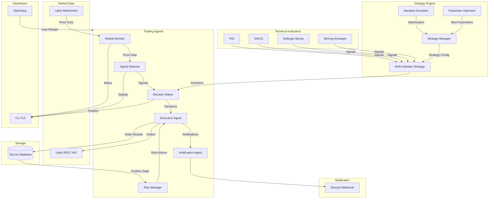

# AutoCoin

Upbit Automated Trading Agent System

[](https://www.rust-lang.org/)
[](https://opensource.org/licenses/MIT)
[](.moai/specs/SPEC-TRADING-004/spec.md)

## Overview (개요)

AutoCoin은 Upbit API를 활용한 자동 트레이딩 에이전트 시스템입니다. 멀티 에이전트 아키텍처를 기반으로 시장 모니터링, 모멘텀 감지, 자동 매수/매도, 리스크 관리를 완전 자동화로 수행합니다.

### Key Features (주요 기능)

- **Multi-Agent Architecture**: 6개의 독립적인 에이전트로 구성된 모듈형 시스템
- **Market Monitor Agent**: Upbit WebSocket을 통한 실시간 시세 수집
- **Signal Detector Agent**: 모멘텀/서징 감지 및 매수 신호 생성
- **Decision Maker Agent**: 포지션 관리 및 최종 거래 결정
- **Execution Agent**: Upbit API를 통한 자동 주문 실행
- **Risk Manager Agent**: 손절/익절 자동 실행
- **Notification Agent**: Discord Webhook을 통한 실시간 알림

### New Features v0.3.0 (신규 기능)

- **Web Dashboard**: Next.js 16 + React 19 기반 웹 대시보드
- **Real-time WebSocket**: 실시간 가격 업데이트 및 트레이딩 상태 동기화
- **Responsive Design**: 데스크톱/모바일 반응형 UI
- **Dark Mode**: 다크/라이트 테마 지원
- **Interactive Charts**: Recharts 기반 PnL 차트 및 시장 데이터 시각화
- **Settings Management**: 웹 기반 전략 파라미터 및 리스크 관리 설정
- **Manual Trading**: 웹 대시보드에서 수동 매수/매도 기능
- **REST API**: Axum 기반 REST API 엔드포인트

### v0.2.0 Features

- **CLI Dashboard**: ratatui 기반 TUI 대시보드로 실시간 상태 모니터링
- **24h Execution**: 데몬 모드, 워치독, systemd/Task Scheduler로 24시간 운영
- **Advanced Indicators**: RSI, MACD, Bollinger Bands, SMA/EMA 기술적 분석 지표
- **Multi-Indicator Strategy**: 다중 지표 결합 전략과 신호 점수화 시스템
- **Backtesting**: 과거 데이터 기반 백테스팅 및 성과 분석
- **Parameter Optimization**: 그리드 서치 기반 파라미터 최적화
- **Strategy Manager**: 런타임 전략 전환 지원

### Trading Strategy (트레이딩 전략)

**기본 전략**:
- **Momentum Following**: 가격 급등과 거래량 급증을 감지하는 모멘텀 전략
- **Single Position**: 동시에 1개 코인만 보유하는 집중 투자 전략
- **Risk Management**: 자동 손절(-5%), 익절(+10%) 기능

**고급 전략 (v0.2.0)**:
- **RSI Strategy**: 상대 강도 지표 기반 매수/매도 (과매수 >70, 과매도 <30)
- **MACD Strategy**: 이동평균 수렴 발산 지표 기반 추세 추종
- **Bollinger Bands**: 변동성 기반 매수/매도 신호
- **Golden Cross**: 단기/장기 이동평균선 교차 전략
- **Multi-Indicator**: 여러 지표를 결합한 신호 점수화 시스템

## Prerequisites (사전 요구사항)

- **Rust**: 1.85 이상
- **Node.js**: 20+ (웹 대시보드)
- **Upbit API Account**: [Upbit Open API](https://docs.upbit.com/) 키 발급 필요
- **Discord Webhook** (선택): 거래 알림을 받을 Discord 웹훅 URL

## Installation (설치)

### 1. Repository Clone (저장소 복제)

```bash
git clone https://github.com/your-org/autocoin.git
cd autocoin
```

### 2. Environment Setup (환경 설정)

`.env.example` 파일을 복사하여 `.env` 파일을 생성하고 Upbit API 키를 입력하세요:

```bash
cp .env.example .env
```

### 3. Environment Variables (환경 변수)

`.env` 파일에 다음 설정을 추가하세요:

```bash
# Upbit API (필수)
UPBIT_ACCESS_KEY=your_access_key_here
UPBIT_SECRET_KEY=your_secret_key_here
UPBIT_API_URL=https://api.upbit.com/v1
UPBIT_WS_URL=wss://api.upbit.com/websocket/v1

# Trading Parameters (트레이딩 파라미터)
TRADING_TARGET_COINS=20              # 상위 N개 코인 모니터링
TARGET_PROFIT_RATE=0.10              # 목표 수익률 10%
STOP_LOSS_RATE=0.05                  # 손절률 5%
SURGE_THRESHOLD=0.05                 # 급등 감지 임계값 5%
SURGE_TIMEFRAME_MINUTES=60           # 감지 시간 프레임 60분
VOLUME_MULTIPLIER=2.0                # 거래량 배수
MIN_ORDER_AMOUNT_KRW=5000            # 최소 주문 금액

# Discord Notification (선택)
DISCORD_WEBHOOK_URL=https://discord.com/api/webhooks/...

# System (시스템)
LOG_LEVEL=info
RUST_LOG=info
DB_PATH=./data/trading.db

# Strategy Config (전략 설정)
STRATEGY_CONFIG=./config/strategy.toml
```

### 4. Build (빌드)

```bash
cargo build --release
```

## Configuration (설정)

### Strategy Config (전략 설정)

`config/strategy.toml` 파일에서 전략 파라미터를 설정할 수 있습니다:

```toml
[strategy]
name = "momentum_following"
version = "1.0"

[strategy.surge_detection]
timeframe_minutes = 60      # 급등 감지 시간 프레임
threshold_percent = 5.0     # 급등 임계값 (%)
volume_multiplier = 2.0     # 거래량 배수

[strategy.position]
max_positions = 1           # 최대 포지션 수
max_position_ratio = 0.5    # 최대 포지션 비율

[strategy.risk]
stop_loss_percent = 5.0     # 손절률 (%)
take_profit_percent = 10.0  # 익절률 (%)
trailing_stop_enabled = false

[strategy.targets]
top_n_coins = 20            # 모니터링 할 코인 수
min_volume_24h = 1000000000 # 최소 24시간 거래량

# 고급 지표 설정 (v0.2.0)
[indicators.rsi]
period = 14                 # RSI 기간
oversold = 30               # 과매도 임계값
overbought = 70             # 과매수 임계값

[indicators.macd]
fast_period = 12            # 빠른 EMA 기간
slow_period = 26            # 느린 EMA 기간
signal_period = 9           # 시그널 라인 기간

[indicators.bollinger]
period = 20                 # 기간
std_dev = 2.0               # 표준편차 배수

[indicators.sma]
short_period = 5            # 단기 기간
long_period = 20            # 장기 기간
```

## Usage (사용법)

### Running the Bot (봇 실행)

```bash
# 개발 모드 실행
cargo run

# 릴리스 모드 실행
cargo run --release

# CLI 대시보드 모드 (TUI)
cargo run -- --dashboard

# 백그라운드 데몬 모드
cargo run -- --daemon

# 백그라운드 실행 (Linux/macOS)
nohup ./target/release/autocoin --daemon > logs/autocoin.log 2>&1 &

# 웹 대시보드와 함께 실행
cargo run -- --web
```

### Web Dashboard (웹 대시보드)

웹 대시보드를 실행하여 브라우저에서 트레이딩 시스템을 모니터링하고 제어할 수 있습니다:

```bash
# 1. 웹 서버와 함께 트레이딩 봇 시작
cargo run -- --web

# 2. 별도로 웹 프론트엔드 시작
cd web
npm install
npm run dev

# 3. 브라우저에서 접속
# http://localhost:3000
```

웹 대시보드 기능:
- **Dashboard**: 포트폴리오 요약, 현재 포지션, PnL 차트, 최근 거래
- **Markets**: 실시간 시장 데이터 및 가격 모니터링
- **Trades**: 거래 내역 조회 및 필터링
- **Backtest**: 백테스팅 설정 및 결과 분석
- **Settings**: 전략 파라미터, 리스크 관리, 시스템 제어
- **Real-time Updates**: WebSocket 기반 실시간 데이터 동기화
- **Dark Mode**: 다크/라이트 테마 전환
- **Responsive**: 모바일 최적화 레이아웃

### First Launch Safety (첫 실행 안전장치)

첫 실행 시 시스템은 다음을 수행합니다:

1. 설정 유효성 검증
2. 데이터베이스 초기화
3. Upbit API 연결 테스트
4. 계정 잔고 조회
5. 기존 포지션 복원

### Logs (로그)

```bash
# 실시간 로그 확인 (JSON 형식)
tail -f logs/autocoin.log | jq

# 일반 텍스트 로그 (개발 모드)
LOG_JSON=false cargo run
```

## Architecture (아키텍처)



### Agent Descriptions (에이전트 설명)

| Agent | Role (역할) |
|-------|-------------|
| **Market Monitor** | Upbit WebSocket 연결 유지, 실시간 시세 수집 |
| **Signal Detector** | 모멘텀 분석, 매수/매도 신호 생성 |
| **Decision Maker** | 포지션 상태 확인, 최종 거래 결정 |
| **Execution Agent** | 주문 실행, 체결 확인 |
| **Risk Manager** | 손절/익절 모니터링, 리스크 관리 |
| **Notification Agent** | Discord 알림 전송 |

### Indicators (기술적 지표)

| Indicator | Description (설명) |
|-----------|-------------------|
| **RSI** | Relative Strength Index (상대 강도 지표) - 과매수/과매도 감지 |
| **MACD** | Moving Average Convergence Divergence - 추세 반전 신호 |
| **Bollinger Bands** | 변동성 밴드 - 가격 범위 분석 |
| **SMA/EMA** | Simple/Exponential Moving Average - 추세 방향 확인 |

### CLI Dashboard (CLI 대시보드)

`--dashboard` 플래그로 TUI 대시보드를 실행합니다:

```bash
autocoin --dashboard
```

대시보드 기능:
- 4패널 레이아웃 (상태, 포지션, 잔고, 시장)
- 실시간 에이전트 상태 모니터링
- 포지션 PnL (손익) 시각화
- 실시간 알림 로그
- 키보드 단축키 지원 (q: 종료, p: 일시정지, r: 재개)

## Testing (테스트)

### Unit Tests (단위 테스트)

```bash
# 전체 테스트 실행
cargo test

# 특정 모듈 테스트
cargo test types::trading
cargo test strategy::momentum

# 테스트 결과 출력
cargo test -- --nocapture
```

### Integration Tests (통합 테스트)

```bash
# 통합 테스트 실행 (Upbit API 모의)
cargo test --test integration
```

## Project Structure (프로젝트 구조)

```
autocoin/
├── src/
│   ├── agents/           # Multi-Agent 구현
│   │   ├── market_monitor.rs
│   │   ├── signal_detector.rs
│   │   ├── decision_maker.rs
│   │   ├── executor.rs
│   │   ├── risk_manager.rs
│   │   └── notification.rs
│   ├── indicators/       # 기술적 지표 (v0.2.0)
│   │   ├── mod.rs
│   │   ├── rsi.rs
│   │   ├── macd.rs
│   │   ├── bollinger.rs
│   │   └── moving_average.rs
│   ├── backtest/         # 백테스팅 엔진 (v0.2.0)
│   │   ├── mod.rs
│   │   ├── simulator.rs
│   │   ├── metrics.rs
│   │   └── optimizer.rs
│   ├── dashboard/        # CLI 대시보드 (v0.2.0)
│   │   ├── mod.rs
│   │   ├── ui.rs
│   │   └── event_handler.rs
│   ├── strategy/         # 트레이딩 전략
│   │   ├── mod.rs
│   │   ├── momentum.rs
│   │   ├── multi_indicator.rs
│   │   └── strategy_manager.rs
│   ├── config/           # 설정 관리
│   ├── db/               # 데이터베이스 (SQLite)
│   ├── discord/          # Discord Webhook
│   ├── types/            # 핵심 데이터 타입
│   ├── upbit/            # Upbit API 클라이언트
│   ├── error.rs          # 에러 처리
│   ├── lib.rs
│   └── main.rs           # 엔트리 포인트
├── config/
│   └── strategy.toml     # 전략 설정
├── systemd/              # systemd 서비스 파일 (v0.2.0)
├── taskscheduler/        # Windows Task Scheduler (v0.2.0)
├── data/                 # 데이터 디렉토리 (Git 제외)
├── web/                  # 웹 대시보드 (v0.3.0)
│   ├── app/              # Next.js 16 App Router
│   ├── components/       # React 컴포넌트
│   ├── lib/              # 유틸리티 및 API 클라이언트
│   └── package.json
├── src/web/              # 웹 서버 (Axum) (v0.3.0)
│   ├── handlers.rs       # REST API 핸들러
│   ├── websocket.rs      # WebSocket 핸들러
│   ├── server.rs         # 웹 서버 구현
│   ├── state.rs          # 공유 상태 관리
│   └── routes.rs         # 라우트 정의
├── .moai/                # MoAI-ADK 설정
├── .env.example          # 환경 변수 예시
├── Cargo.toml
├── README.md
├── ARCHITECTURE.md
└── API.md
```

## Risk Warning (리스크 경고)

**중요**: 이 소프트웨어는 교육 목적으로 제공됩니다. 암호화폐 트레이딩에는 높은 리스크가 따르며:

- **본인의 판단과 책임** 하에 사용하세요
- **소액으로 테스트** 한 후 정식 운영을 권장합니다
- **손실 가능성**을 충분히 인지하세요
- 개발자는 어떠한 손실에 대해서도 책임지지 않습니다

## Troubleshooting (문제 해결)

### Common Issues (일반적인 문제)

| Issue | Solution |
|-------|----------|
| `UPBIT_ACCESS_KEY is required` | `.env` 파일에 API 키가 올바르게 설정되었는지 확인하세요 |
| `Rate limit exceeded` | API 호출 빈도를 줄이거나 다시 실행하세요 |
| WebSocket 연결 끊김 | 시스템이 자동으로 재연결을 시도합니다 |
| 대시보드가 깨져서 보임 | 터미널 크기를 80x24 이상으로 조정하세요 |
| 백테스팅 데이터 부족 | 최소 100개 캔들 데이터가 필요합니다 |

### Dashboard Shortcuts (대시보드 단축키)

| Key | Action |
|-----|--------|
| `q` | 프로그램 종료 |
| `p` | 트레이딩 일시정지 |
| `r` | 트레이딩 재개 |
| `?` | 도움말 표시 |
| `Ctrl+C` | 강제 종료 |

## Web Dashboard API (웹 대시보드 API)

### REST Endpoints

| Method | Endpoint | Description |
|--------|----------|-------------|
| GET | `/api/health` | 헬스 체크 |
| GET | `/api/status` | 시스템 상태 조회 |
| GET | `/api/balance` | 잔고 조회 |
| GET | `/api/position` | 현재 포지션 조회 |
| GET | `/api/trades` | 거래 내역 조회 |
| GET | `/api/markets` | 시장 데이터 조회 |
| GET | `/api/dashboard` | 대시보드 데이터 통합 조회 |
| GET | `/api/agents/status` | 에이전트 상태 조회 |
| POST | `/api/orders` | 수동 주문 생성 |
| DELETE | `/api/position` | 포지션 청산 |
| PUT | `/api/settings` | 설정 업데이트 |
| POST | `/api/trading/pause` | 트레이딩 일시정지 |
| POST | `/api/trading/resume` | 트레이딩 재개 |

### WebSocket Events

| Event | Description |
|-------|-------------|
| `price_update` | 실시간 가격 업데이트 |
| `trade_executed` | 주문 체결 알림 |
| `position_update` | 포지션 변경 알림 |
| `agent_status` | 에이전트 상태 변경 |
| `notification` | 시스템 알림 |

## License (라이선스)

MIT License - [LICENSE](LICENSE) 파일을 참조하세요

## Links (관련 링크)

- [Upbit Open API Docs](https://docs.upbit.com/)
- [SPEC-TRADING-001](.moai/specs/SPEC-TRADING-001/spec.md) - 시스템 사양서
- [SPEC-TRADING-002](.moai/specs/SPEC-TRADING-002/spec.md) - CLI 대시보드 사양서
- [SPEC-TRADING-003](.moai/specs/SPEC-TRADING-003/spec.md) - 고급 전략 사양서
- [SPEC-TRADING-004](.moai/specs/SPEC-TRADING-004/spec.md) - 웹 대시보드 사양서
- [ARCHITECTURE.md](ARCHITECTURE.md) - 아키텍처 상세 문서
- [API.md](API.md) - API 통합 문서
